# Unsupervised Learning-Cryptocurrency Clusters:

A prominent investment bank, is interested in offering a new cryptocurrency investment portfolio for its customers. The task is to find out what cryptocurrencies are on the trading market and determine whether they can be grouped to create a classification system for this new investment. Unsupervised learning is performed when we need to know the outcome or classification of the data. Following are the steps performed for achieving the objectives.

## Exploratory Data Analysis (EDA):

Here the data is inspected for preprocessing, which includes:

1. Drop the unnamed column as it does not contribute to clustering or add value to input data
2. List the DataFrame's data types to ensure they're aligned to the type of data stored on each column.
3. Is there any column whose data type need to be changed? If so, make the corresponding adjustments.
4. Is there any unnecessary column that needs to be dropped? If so, make the corresponding adjustments.
5. Check for duplicates.
6. In order to use unsupervised learning algorithms, all the features should be numeric, and also, on similar scales.
7. Rename the column if needed.
8. Check for categorical data in columns.

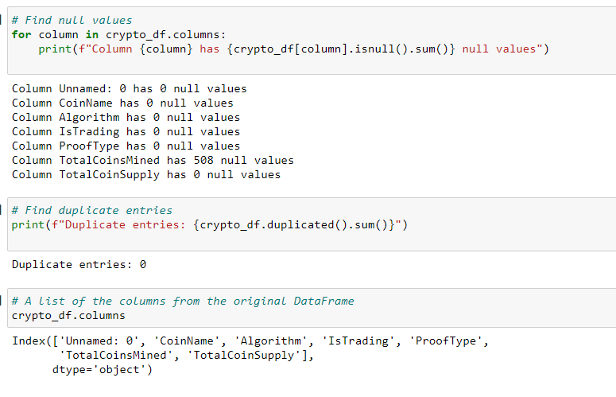

## Data Preprocessing:

Now the data cleaning and perprocessing steps are performed.

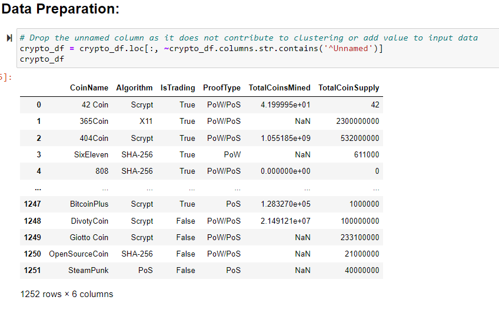

All cryptocurrencies that are not being traded are discarded. In other words, we filter for currencies that are currently being traded and IsTrading column is dropped from the dataframe.

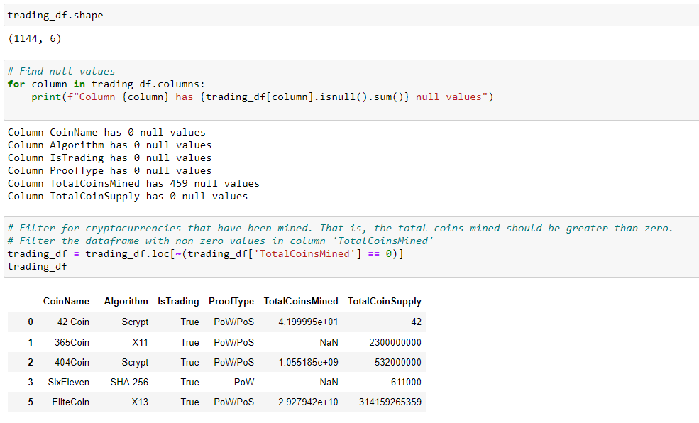

Convert the categorical columns into numeric data.

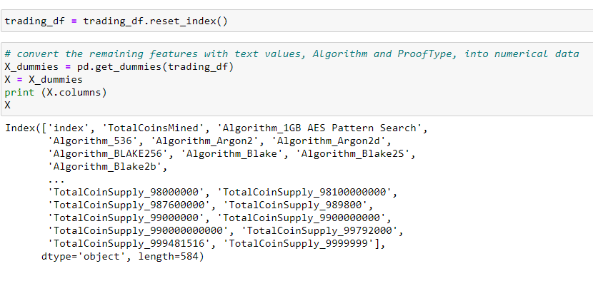

Standerized the dataset so that columns containing the larger values do not influence the outcome.

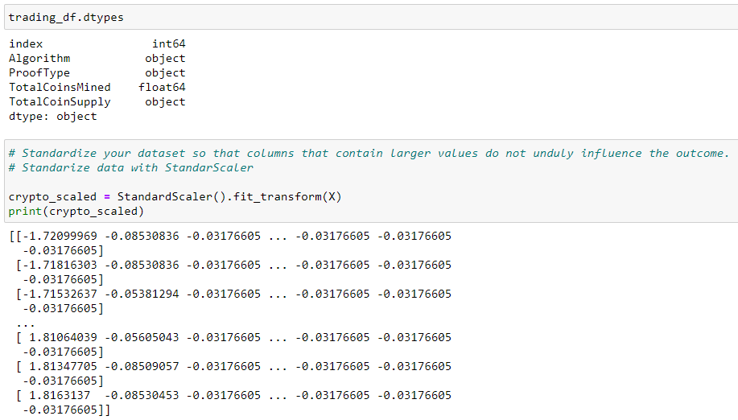

## Dimensionality Reduction:

Since creating dummy variables, increased the number of features in the dataset, we performed the dimensionality reduction using 'Principle Component Analysis' (PCA). For this project, we are preserving 90% of the explained variance in dimensionality reduction.

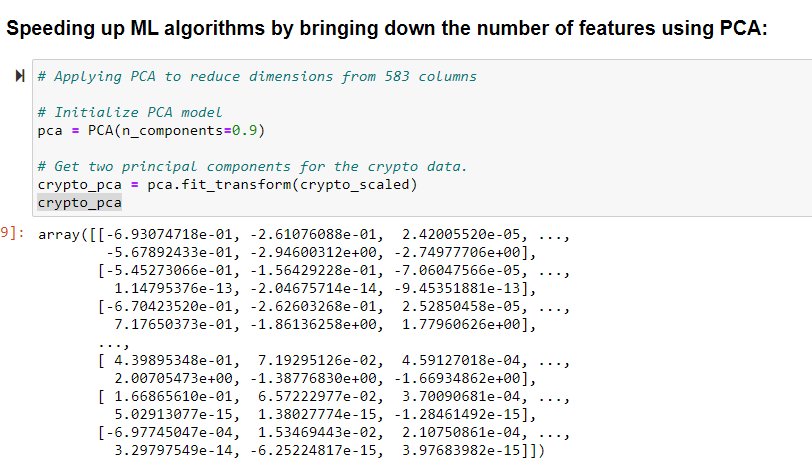

## Sample Analysis:

After applying PCA, dimensionality has reduced from 583 columns to 452 columns. According to the explained variance, all the principal component contains approximately 0.5% of the variance.

## Running KMeans with PCA Data for Cluster Analysis :

KMean is an unsupervised machine algorithm, which can be applied when we want to know the optimal number of classification from it.

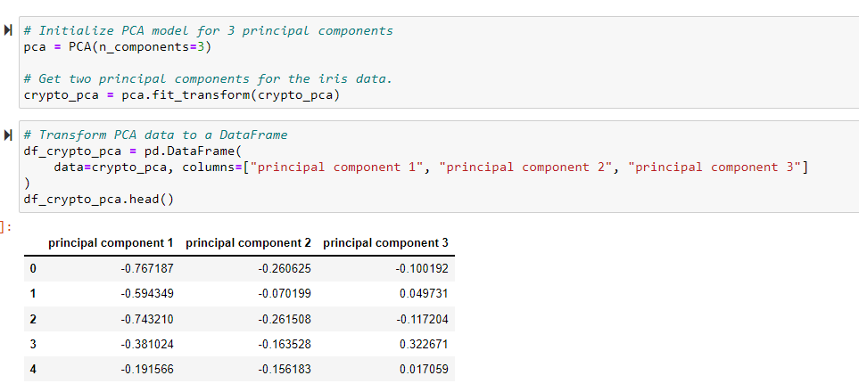

## Sample Analysis:

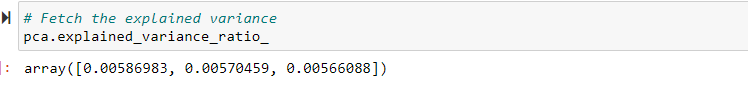

According to the explained variance, the first principal component contains approximately `0.6%` of the variance and the second principal component contains `0.6%` of the variance. We have approximately `1%` of the information in the original dataset, and we will see whether increasing the number of principal components to 3 will increase the explained variance.

## Predicting and Visualizing with n_clusters=3:

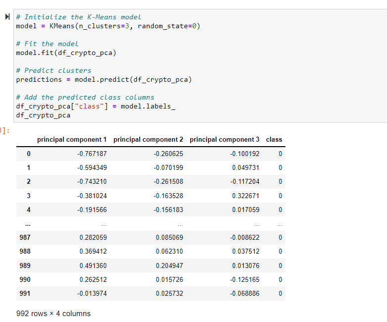

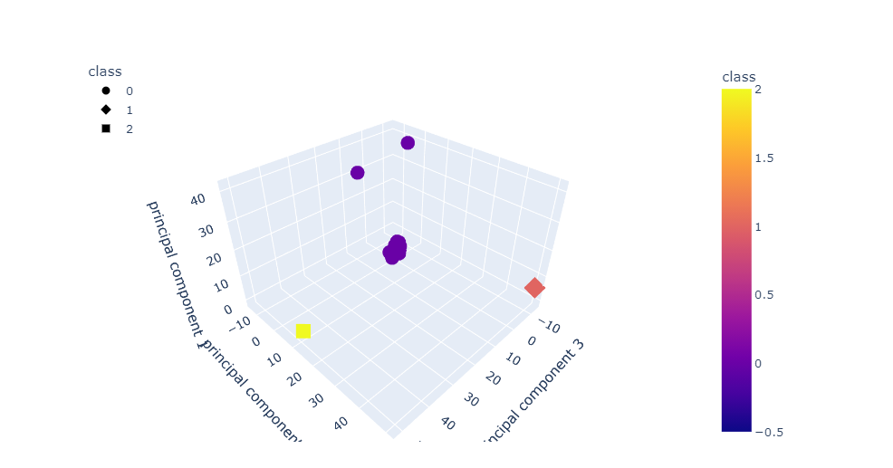

## Elbow Curve:

Here we want to identify the best number of clusters visually using elbow curve.

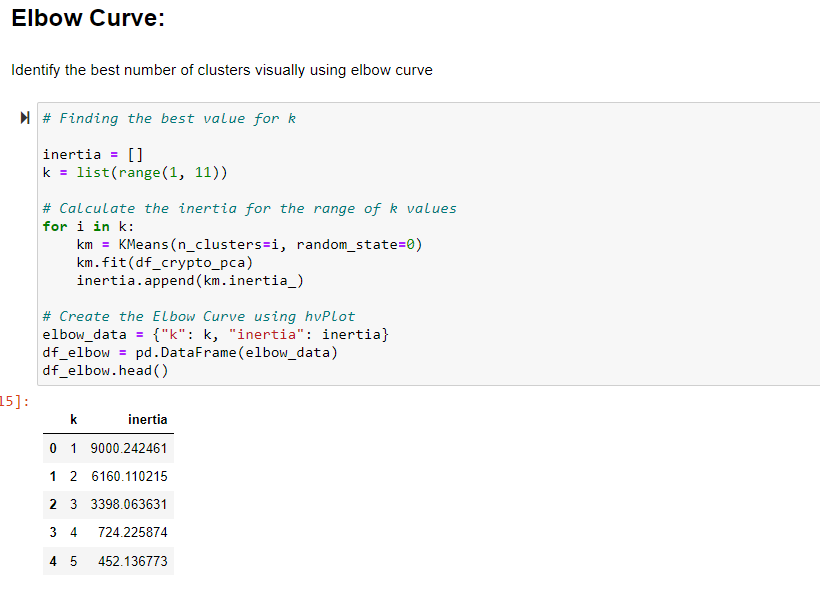

## Further reduce the dataset dimensions with t-SNE and visually inspect the results:

Next, we further reduce the dataset dimensions with t-SNE and visually inspect the results. In order to accomplish this task, we run t-SNE on the principal components: the output of the PCA transformation. Then create a scatter plot of the t-SNE output. Observe whether there are distinct clusters or not.

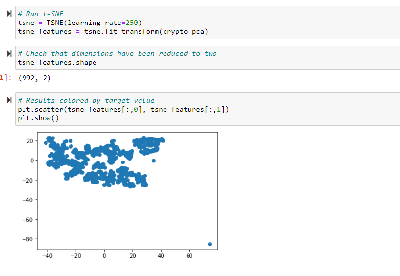

## Recommendation:

Data does not seems to be divided into more than one cluster of any importance. The cryptocurrencies data does not shows any significant clustering possible.